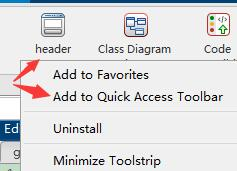

# Matlab functions and class comment template
Easy to use m-file comment template! Custom/predefined comment modules for matlab functions and classes.<br>

## How to install
First double-click directly on "header.mlappinstall" and then right-click on "Add to Quick Access Toolbar". <br>


## How to use
1. Open the script m file you want to comment;<br>
1. use the shortcut "alt" + "1"  or click on the "header" icon in the Quick Access toolbar or type "header" in the command window.<br>

## How to modify the template to suit your needs?
Type this on the command line:`edit header.m`,then modify it.<br>

## Examples
Define the function or class file in your script(it is not necessary to define it completely, only the function prototype signature is needed), then press the shortcut **"alt" + "1"** or click the "header" header in the **"Quick Access Toolbar"** or type **`header`** In the command line window.If you don't want to automatically insert comments in some functions or classes, you can ignore them by starting the line below the function or class signature with "%".<br>
- function example
```matlab
t = 1:.1:2*pi;
y = sin(t);
plot(t,y);

function out = myfun1(a,b,c)
% Brief: One line description of what the function or class performs
% Details:
%    None
% 
% Syntax:  
%     out = myfun1(a,b,c)
% 
% Inputs:
%    a - [m,n] size,[double] type,Description
%    b - [m,n] size,[double] type,Description
%    c - [m,n] size,[double] type,Description
% 
% Outputs:
%    out - [m,n] size,[double] type,Description
% 
% Example: 
%    None
% 
% See also: None

% Author:                          yourname
% Email:                           youremail@email.com
% Created:                         27-Mar-2022 20:13:59
% Version history revision notes:
%                                  None
% Implementation In Matlab R2022a
% Copyright © 2022 yourOrganization.All Rights Reserved.
%
out = a+b+c;
end 

function out = myfun2(argument1,argument2,...
    argument3,argument4,...
    argument5,argument6)
% Brief: One line description of what the function or class performs
% Details:
%    None
% 
% Syntax:  
%     out = myfun2(argument1,argument2,argument3,argument4,argument5,argument6)
% 
% Inputs:
%    argument1 - [m,n] size,[double] type,Description
%    argument2 - [m,n] size,[double] type,Description
%    argument3 - [m,n] size,[double] type,Description
%    argument4 - [m,n] size,[double] type,Description
%    argument5 - [m,n] size,[double] type,Description
%    argument6 - [m,n] size,[double] type,Description
% 
% Outputs:
%    out - [m,n] size,[double] type,Description
% 
% Example: 
%    None
% 
% See also: None

% Author:                          yourname
% Email:                           youremail@email.com
% Created:                         27-Mar-2022 20:13:59
% Version history revision notes:
%                                  None
% Implementation In Matlab R2022a
% Copyright © 2022 yourOrganization.All Rights Reserved.
%
out = argument1+argument2+argument3+argument4+argument5+argument6;
end 
```

- classdef example
```matlab
classdef Motor < ElectricVehicleComponent
% Brief: One line description of what the function or class performs
% Details:
%    None
% 
% Syntax:  
%     Motor < ElectricVehicleComponent
% 
% Inputs:
%    None
% 
% Outputs:
%    None
% 
% Example: 
%    None
% 
% See also: None

% Author:                          yourname
% Email:                           youremail@email.com
% Created:                         27-Mar-2022 20:16:17
% Version history revision notes:
%                                  None
% Implementation In Matlab R2022a
% Copyright © 2022 yourOrganization.All Rights Reserved.
%
   
    properties
        CurrentSpeed = 0
        SpeedRange = [0, 180]
    end

    methods
        function motor = start(motor,speed)
% Brief: One line description of what the function or class performs
% Details:
%    None
% 
% Syntax:  
%     motor = start(motor,speed)
% 
% Inputs:
%    motor - [m,n] size,[double] type,Description
%    speed - [m,n] size,[double] type,Description
% 
% Outputs:
%    motor - [m,n] size,[double] type,Description
% 
% Example: 
%    None
% 
% See also: None

% Author:                          yourname
% Email:                           youremail@email.com
% Created:                         27-Mar-2022 20:16:17
% Version history revision notes:
%                                  None
% Implementation In Matlab R2022a
% Copyright © 2022 yourOrganization.All Rights Reserved.
%
            arguments
                motor (1,1) Motor
                speed (1,1) {mustBeReal, mustBeNonnegative}
            end
            if motor.CurrentSpeed > 0
                error("Motor:start:MotorAlreadyRunning",...
                    "Cannot start a motor that is already running.")
            end
            motor.CurrentSpeed = speed;   
        end
        
        function motor = stop(motor)
% Brief: One line description of what the function or class performs
% Details:
%    None
% 
% Syntax:  
%     motor = stop(motor)
% 
% Inputs:
%    motor - [m,n] size,[double] type,Description
% 
% Outputs:
%    motor - [m,n] size,[double] type,Description
% 
% Example: 
%    None
% 
% See also: None

% Author:                          yourname
% Email:                           youremail@email.com
% Created:                         27-Mar-2022 20:16:17
% Version history revision notes:
%                                  None
% Implementation In Matlab R2022a
% Copyright © 2022 yourOrganization.All Rights Reserved.
%
            if motor.CurrentSpeed == 0
                error("Motor:start:MotorNotRunning",...
                    "Cannot stop a motor that is not running.")
            end
            motor.CurrentSpeed = 0;
        end
    end
end
```
